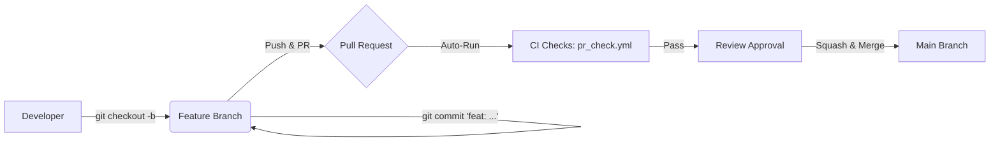
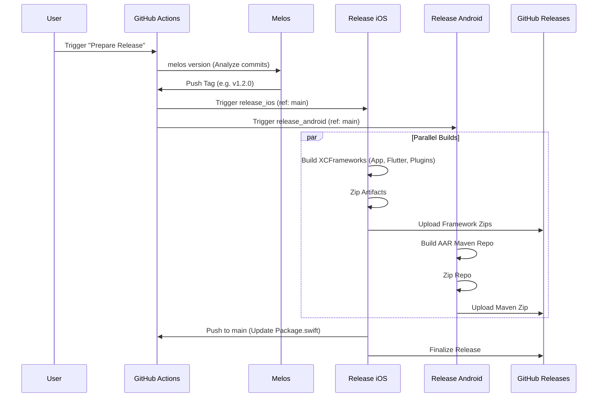

# Contributing Guide

This guide details the complete development lifecycle for this Flutter Monorepo, from writing code to publishing releases.

## 1. The Development Cycle



### Step 1: Create a Feature Branch
Always work on a separate branch. Do not push directly to `main`.
```bash
git checkout -b feat/my-new-feature
# or
git checkout -b fix/bug-fix-name
```

### Step 2: Make Your Changes
Edit files, add features, or fix bugs.

### Step 3: Commit with "Conventional Commits" 🚨
**Crucial**: Our release system (`melos version`) relies on your commit messages to determine the next version number.
*   **`feat: ...`** -> Triggers a **Minor** version bump (1.1.0 -> 1.2.0).
*   **`fix: ...`** -> Triggers a **Patch** version bump (1.1.0 -> 1.1.1).
*   **`feat!: ...`** -> Triggers a **Major** version bump (1.0.0 -> 2.0.0).
*   `docs:`, `chore:`, `style:`, `refactor:` -> No release trigger (usually).

**Example:**
```bash
git commit -m "feat: add user profile screen"
```

### Step 4: Push and PR
Push your branch to GitHub and open a Pull Request against `main`.

### Step 5: CI Checks
The `pr_check.yml` workflow will automatically run:
*   Analyzes code (linting).
*   Runs tests.
*   Verifies build validity.

**You must pass these checks to merge.**

### Step 6: Merge
Once approved and green, merge the PR into `main`.
*   **Recommendation**: Use "Squash and Merge" to keep the `main` history clean and ensuring the commit message on `main` follows the Conventional Commit format.

---

## 2. The Release Cycle



Releases are **manual** but **automated**. You decide *when* to release, the system does the rest.

### Step 1: Trigger Release
1.  Go to the **Actions** tab in GitHub.
2.  Select the **Prepare Release** workflow on the left.
3.  Click **Run workflow**.
4.  Branch: `main`.
5.  Click the green **Run workflow** button.

### Step 2: Automation (What happens next?)
The system performs the following sequence automatically:
1.  **Versioning**: `melos version` analyzes your PR commits on `main`.
    *   If you merged a `feat:`, it bumps the version.
    *   It updates `pubspec.yaml` and `CHANGELOG.md`.
    *   It creates a Git Tag (e.g., `1.2.0`).
2.  **Building**: Two parallel jobs start:
    *   **iOS**: Builds `App.xcframework`, `Flutter.xcframework`, and `FlutterPluginRegistrant.xcframework`. 
    *   **Android**: Builds the Maven Repository (`.aar` files).
3.  **Publishing**:
    *   All artifacts are uploaded to the **Releases** page on GitHub.
    *   **Manifest Sync**: `Package.swift` is updated with the new checksums and **pushed back to the `main` branch**.

### Step 3: Consumption
*   **iOS (SPM)**: 
    *   Connect to: `https://github.com/davidcastano-verygoodventures/flutter_melos_monorepo`
    *   Rule: **Branch: main** (Recommended) or **Tag: X.Y.Z**.
    *   **Important**: You must import `FlutterPluginRegistrant` in your Swift code to register plugins.
*   **Android**: Download the `android_maven_repo.zip` from the Releases page and unzip it into your native Android project's repository.

---

## 3. Maintenance & Troubleshooting

### SPM Checksum Mismatches
If Xcode complains about a checksum mismatch:
1.  Ensure you are on the **Branch: main** rule.
2.  Go to **File > Packages > Reset Package Caches**.

### Missing Plugins
If a plugin doesn't work in the native app:
1.  Check if `import FlutterPluginRegistrant` is at the top of your Swift file.
2.  Ensure you call `GeneratedPluginRegistrant.register(with: flutterEngine)` in your init code.
