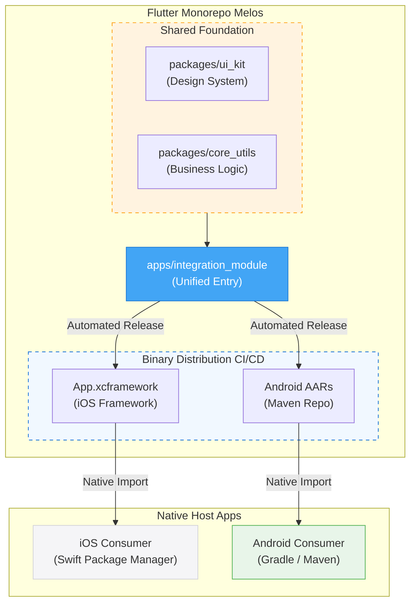

# Flutter Melos Monorepo

A high-performance Flutter monorepo designed for native app integration (Add-to-App) with a professional-grade automated release pipeline.

## Architecture (The PoC)

## Table of Contents
- [Architecture (The PoC)](#architecture-the-poc)
- [Key Features](#key-features)
- [Project Structure](#project-structure)
- [Documentation](#documentation)
- [Examples](#examples)

## Key Features
- **Monorepo Management**: Powered by [Melos](https://melos.invertase.dev/).
- **Automated Versioning**: Semantic versioning based on Conventional Commits.
- **Binary Distribution**: 
  - **iOS**: Published via Swift Package Manager (SPM) with automated XCFramework zipping.
  - **Android**: Published as a Zipped Maven Repository for easy Gradle integration.
- **Plugin Support**: Built-in logic to handle `FlutterPluginRegistrant` automatically.

## Project Structure
- `apps/integration_module`: The unified Flutter module that serves as the entry point for native apps.
- `packages/ui_kit`: **Shared Design System** containing reusable widgets and themes used across all apps.
- `packages/core_utils`: **Shared Business Logic** and utilities, ensuring consistent behavior across different modules.
- `examples/`: Minimal host apps for release verification.

## Documentation
- **[Contributing Guide](CONTRIBUTING.md)**: How to develop, build, and trigger releases.
- **[Android Integration Guide](docs/android_integration.md)**: Detailed guide on Maven-based integration and hosted repository alternatives.

## Examples
- **[iOS Consumer](examples/ios_consumer_app)**: Swift app consuming XCFrameworks.
- **[Android Consumer](examples/android_consumer)**: Android app consuming AARs via Maven.
