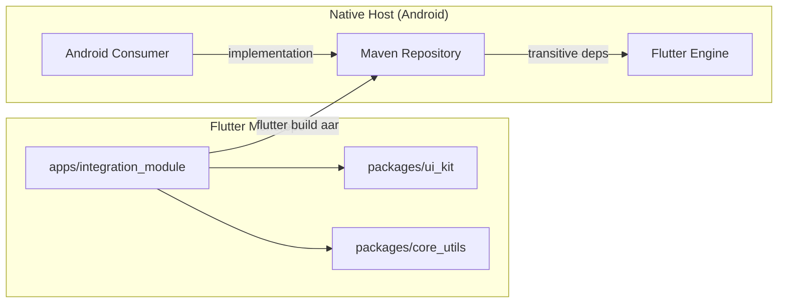

# Android Integration Guide: Consuming Flutter Modules

This guide explains the different ways to integrate your pre-compiled Flutter module into a native Android host application using Maven.

## Overview

Flutter modules can be integrated into Android using two main Maven-based approaches:
1.  **Local Maven Repository (Low friction for testing)**
2.  **Remote/Hosted Maven Repository (Best for production teams)**

## The Approach: "Add-to-App"

This monorepo uses the **Add-to-App** pattern, where Flutter is treated as a library by the native host. The primary goal is to decouple the Flutter development environment from the native one.

### Architectural Flow



---

## 1. Local Maven Repository (Current Approach)

In this setup, the Flutter module and its dependencies are packaged into AAR files and stored in a local folder within the Android project.

### How it works:
1.  Run `flutter build aar` to generate the repository.
2.  The output is a folder structure following the Maven standard (e.g., `build/host/outputs/repo`).
3.  The Android app points its `settings.gradle` to this local folder.

### Configuration (`settings.gradle`):
```gradle
dependencyResolutionManagement {
    repositories {
        google()
        mavenCentral()
        maven {
            url uri("./libs/repo") // Local path
        }
        maven {
            url 'https://storage.googleapis.com/download.flutter.io'
        }
    }
}
```

**Pros:** No internet required for builds, easy to package in a ZIP.
**Cons:** Bloats the Git repository if committed, manual update process.

---

## 2. Remote Maven Repository (The "Better" Way)

Instead of checking Zip files or unzipped repo folders into your project, you should host these artifacts on a private Maven server like **GitHub Packages**, **Artifactory**, or **Cloudsmith**.

### Why it's better:
- **Smaller Git Size**: You only store code, not binaries.
- **Easy Versioning**: Change one line in `build.gradle` to upgrade (e.g., `1.0.0` -> `1.1.0`).
- **Parallel Work**: Android developers don't need to manually run setup scripts; Gradle handles everything.

### Example: GitHub Packages Integration

#### Step 1: Publishing
Configure your CI/CD (GitHub Actions) to publish the generated AAR to GitHub Packages.

#### Step 2: Consuming (`settings.gradle`)
```gradle
dependencyResolutionManagement {
    repositories {
        google()
        mavenCentral()
        maven {
            name = "GitHubPackages"
            url = uri("https://maven.pkg.github.com/OWNER/REPOSITORY")
            credentials {
                username = System.getenv("GITHUB_ACTOR")
                password = System.getenv("GITHUB_TOKEN")
            }
        }
        maven {
            url 'https://storage.googleapis.com/download.flutter.io'
        }
    }
}
```

#### Step 3: Dependency (`build.gradle`)
```gradle
dependencies {
    implementation 'com.example.integration_module:flutter_release:1.1.0'
}
```

---

## Technical Recommendations

### Use JVM Toolchains
To avoid the `Inconsistent JVM Target` errors seen in native Android projects, always define a toolchain in your `build.gradle`:

```gradle
kotlin {
    jvmToolchain(17)
}
```

### Memory Management
Flutter artifacts can be large. Ensure your `gradle.properties` has enough heap space:
```ini
org.gradle.jvmargs=-Xmx4g -XX:MaxMetaspaceSize=512m
```
